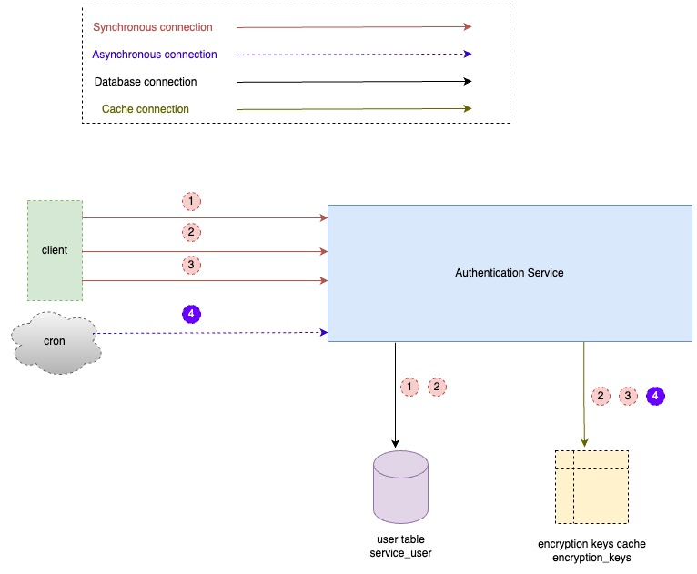

## go-authentication-service

A sample go service for authenticating client requests 

## Stack
1. Go
2. Postgres
3. Redis
4. Docker and docker-compose
5. Deps
   *  [github.com/gorilla/mux](https://github.com/gorilla/mux)
   *  [github.com/golang-jwt/jwt](https://github.com/golang-jwt/jwt)
   *  [github.com/golang-migrate/migrate/v4](https://github.com/golang-migrate/migrate)
   *  [github.com/google/uuid](https://github.com/google/uuid)
   *  [github.com/lib/pq](https://github.com/lib/pq)
   *  [github.com/stretchr/testify](https://github.com/stretchr/testify)
   *  [github.com/go-redis/redis/v9](https://github.com/go-redis/redis)
   *  [github.com/testcontainers/testcontainers-go](https://github.com/testcontainers/testcontainers-go)
   *  [go.uber.org/zap](https://go.uber.org/zap)
   *  [ golang.org/x/crypto/bcrypt](https://golang.org/x/crypto/bcrypt)

## Endpoints
```http
BASE_URL localhost:8080/auth-gateway
```

1. Register
```http
GET {BASE_URL}/register
```
This endpoint registers a client service and gives it a secret to identify it during authentication

2. Authorize
```http
GET {BASE_URL}/authorize
```
This endpoint gives a client service a JWT token for authentication

3. Validate Token
```http
GET {BASE_URL}/validate
```
This endpoint validates a JWT token then authorises a client service

4. Rotate Keys
```http
GET {BASE_URL}/rotate
```
This endpoint rotates encryption keys used to generate JWT tokens

## Flow


1. Client service registers with the authentication service, details stored in the database and secret key is granted
2. Using the secret key a client service requests for an authentication token, generated from an encryption key stored in cache
3. Client service requests for validation of authentication token
4. Encryption keys rotated through a cron every 24hrs, the cron triggers generation of new key and deletes any keys older than 48 hrs

## Run Project
`make {ROOT_DIR}/start`
